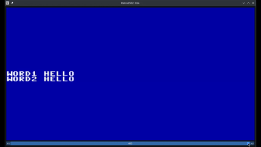

# Retro6502, Julia support for 6502 development
## How to smash a mosquito with a pile driver...

2024-FEB-03

Developing for the 6502 8-bit microprocessor typically means compiling/assembling code, loading it into an emulator
or a physical machine, and running and testing it there. There are advanced debugging environments like
[C64Debugger](https://sourceforge.net/projects/c64-debugger) and the beta
[RetroDebugger](https://github.com/slajerek/RetroDebugger) that let you visualize memory and even use omniscient
debugging, stepping backwards in time and finding the code and point in time that drew a particular pixel.

Despite these advantages, there is plenty of room for improvement. Coding and testing for the 6502 is tedious.
Failure is always part of programming but the slow, error prone aspects of assembly language programming make it
cost even more. If your 6502 code could somehow call Julia code outside the emulator, you could prototype and test
in Julia and then, after the prototype code worked properly, you could write the 6502 code, radically reducing
development time and relieving a lot of pain.

# What it does today

## JULIA-BASED ASSEMBLY

Expressions are all evaluated in Julia and your assembly file can contain Julia code. This
code runs in a sandbox module which contains the ASM labels as variables. This assembler is
2-pass, so your Julia code can refer to labels anyplace in the code.

Here's an [example](examples/simple.jas):

```asm
;; semicolon is the comment character, except in .julia or .jmacro code, which uses normal Julia code

        .include "simple-support.jl" ; contains the zorp function
        .julia floop = "fred"
*       = zorp(0x8000)
        .julia println("CURRENT PC: $(__CONTEXT__.offset)")
        .data string(VERSION)        ; place the current Julia version at this location
        .julia begin #only Julia-style comments here -- ; is a separator
            println("HELLO $floop, start = $start.")
        end
mac     .macro (a)-> asm"""
        .julia println("Hello \a")
        .data "hello"
blub    .value blub
        """
joe
fred    #mac maluba
fred2   #mac maluba2
        .data 0x01
align1  .imm align(4)
        .data 0x01
align2  .imm align(4)
        .data 0x2
align3  .imm align(4)
        .data 0x3
align4  .imm align(4)
        .julia println("Fred: $fred")
        .imm noasm"""
        noasm ignores
        everything in
        its string
        """
fake_hello .fake ()-> println("FAKE HELLO WORLD")
start   PHA
```

### Directives

- `.include`: include a Julia file.
- `.data EXPR`: convert Julia result into bytes and add to memory.
- `.imm EXPR`: execute Julia expression on pass 1, the `align` function should only be called within `.imm`, rather than `.julia`. This is evaluated at the top-level so you can define functions here if you like.
- `.julia EXPR`: execute Julia expression on pass 2. This is evaluated at the top-level so you can define functions here if you like.
- `.macro (ARGS)-> EXPR`: define an asm macro in Julia -- must return an AssemblyCode struct
- `.value EXPR`: specify the value of a macro which gets assigned to the label on its call. This defaults to the first location the macro assembles.
- `.fake ()-> EXPR`: define a fake routine that executes outside the emulator.

### Julia functions and macros

- `align(boundarysize)`: align the current context to a byte boundary -- only call this within `.imm`.
- `data(value)`: the `.data` directive uses this to compute a byte array from Julia data. You can add methods for your own types.
- `asm"..."`: produce an AssemblyCode structure. \NAME is substituted with the current value of NAME. You can use `*` to concatenate AssemblyCode structures.
- `noasm"..."`: project an empty AssemblyCode structure.

## Native Julia 6502 emulation

Retro6502 provides a fast, pure Julia 6502 emulator to provide developers an easy path to extension in a very high
level language without needing to dip down into C / C++ do to the fast parts. The emulator comes with a
comprehensive test suite (thanks to
[Thommyh on Reddit](https://www.reddit.com/r/EmuDev/comments/prq29l/comment/hdqh7rc)), tests
[here](https://drive.google.com/file/d/1XpRo4GvdGKiSCljx2cHzAtxp9TAt7Pfw/view?usp=sharing)). As of 2024 FEB 03, it
passes all of the tests with respect to the register and memory contents. It is not currently "cycle
accurate", meaning that it does not do the redundant writes and reads that the real 6502 does. This could
potentially have implications for high-fidelity hardware emulation. Nevertheless, I think this is a decent place
to start for game development.

## UI with C64 screen

This uses Dear ImGui for its UI. For performance reasons, this uses a separate thread for the emulator -- the
emulator is well encapsulated and you can run more than one if you like.

The C64 screen is very basic, it only supports character graphics, no sprites yet, and does not have raster line
accuracy.

## Time travel

There is basic support for time travel and the UI has a time slider at the bottom.



## Ease of extension

I'm writing this with easy extension in mind. I want it to be painless to add support for embedded 6502 languages,
like FORTH, PICO-8, and others and also support for extra features.

# Why?

I wanted to make a 6502 game in FORTH, so I wrote a simple FORTH interpreter that supports 1-byte instructions
and literal integers in addition to the normal 2-byte FORTH instructions, with the goal of saving memory and
being able to write in a higher level language than 6502 with metaprogramming support.

As I wrote it, I became dissatisfied with the 6502 assembler I was using and I realized that it would be a lot
easier to write macros in Julia instead of the provided macro language. I wondered what kind of advantages Julia
might lend to a 6502 developer in a fully-integrated environment.

# Where is it going?

This project is one month old now. Here are some of the features I'd like to add to it. I will use my game and
FORTH language development to prioritize new features...

## Intended features

1. raster line accuracy
2. Instrumentation -- jump to Julia first before running a 6502 subroutine, writing to a memory location, etc. so
   Julia can keep tabs on your code. Use this to inform Julia about subsystems, interpreters, etc.
3. Call Julia code on raster line changes
4. Live coding / hot patching -- watch files for changes patch the results into the emulator (like Revise for 6502)
5. Read-only memory -- halt the machine when it attempts to write to a restricted address
6. Future screens -- show futures based on potential future inputs
7. Input record / replay -- show screens based on recorded inputs and explore with hot patching
8. Julia-based prototyping -- map Julia functions to 6502 addresses as "virtual 6502 subroutines"
   Use these to prorotype parts of your game in Julia so you can get program functionality going quickly and
   code in 6502 when you see fit.
9. Julia-based testing -- a unit test framework. Keep prototype code around for test confirmation after you code
   it in 6502.
